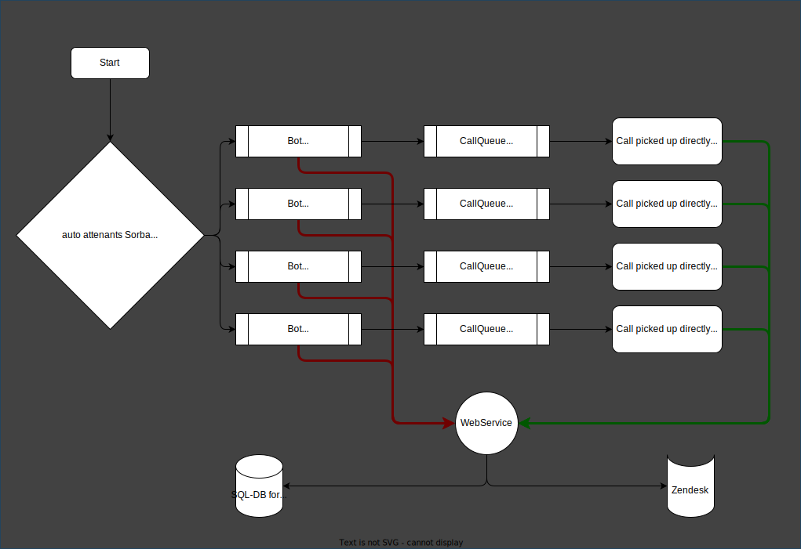

# MS Teams as support hotline

## Rough overview
As the call are comming in to a general phone number, the customers should press:
- 1 for commercial support
- 2 for technical support
- 3 for sales supoprt
- 4 for accounting suport

As the calls get routed to the next step, an bot should pass all the call data into a webservice and creates a database entry. The same webservice should als create a ticket in Zendesk.
(On a later step, we might only put the usefull information into the database)

If the call was picked up by someone of the support staff, the coresponding Zendesk ticket should open in the default browser, and the name of the support team should be written in the database.

